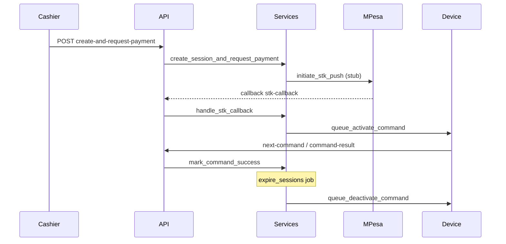

# Safest implementation plan: prepaid Arcadium session flow

## What exists today (relevant conflicts)

| Area | Current implementation | Your target |
|------|------------------------|-------------|
| [stations/models.py](stations/models.py) | `Station.Status`: `available`, `in_use`, `maintenance`; FK `pricing_plan` | `reserved`, `active`, `offline`; package chosen per session |
| [pricing/models.py](pricing/models.py) | `rate_per_hour`, `min_duration_minutes` | Fixed packages: duration + price + `pricing_type` |
| [game_sessions/models.py](game_sessions/models.py) | `ACTIVE`/`PAUSED`/`EXPIRED`/`COMPLETED`, `start_time`/`expected_end_time`, hourly `rate_per_hour` | Full prepaid lifecycle + snapshots + M-Pesa fields + `SessionEvent` |
| [payments/models.py](payments/models.py) | `amount_due`/`amount_paid`, status `pending`/`partial`/`paid` | M-Pesa-centric fields + `success`/`failed`/… |
| [devices/models.py](devices/models.py) | `DeviceCommand` tied to `StationDevice`, `command` uses `activate_station`/`deactivate_station`, status `acknowledged` | Command linked to `station` + `session`, types `activate`/`deactivate`, status `success` |
| [game_sessions/services.py](game_sessions/services.py) | `start_session`, pause/resume/extend/end, hourly billing | `create_session_and_request_payment`, callbacks, queue commands, expiry |
| [devices/api_views.py](devices/api_views.py) | Poll returns `cmd.command` string for firmware | Must keep devices working or map new types → legacy strings |
| [stations/templates/stations/dashboard.html](stations/templates/stations/dashboard.html) | Calls `GET /api/stations/`, `GET /api/sessions/open/`, `POST /api/sessions/start|pause|resume|end|extend/` | **Will break** if those endpoints or response shapes disappear |

[accounts/models.py](accounts/models.py) already has `User.Role` (`admin`, `cashier`, `attendant`) and [accounts/permissions.py](accounts/permissions.py) defines DRF classes—good fit for RBAC; you still need `REST_FRAMEWORK` defaults (currently absent from [arcadium/settings/base.py](arcadium/settings/base.py)) and session auth for staff APIs.

---

## Safest overall strategy (minimal blast radius)

1. **Treat this as a domain migration, not a side-by-side second product.** Reuse app labels (`stations`, `pricing`, `game_sessions`, `payments`, `devices`) but **replace** model fields and service behavior in migrations. SQLite is fine; Django will rebuild tables where needed.

2. **Resolve the “dashboard vs no frontend” constraint explicitly:**  
   The SPA-in-one-file dashboard is **not** a “new frontend” build, but it **is** production-critical. **Safest minimal-change:** either  
   - **(Recommended)** keep **legacy-compatible** endpoints and response shapes for `GET /api/stations/` and `GET /api/sessions/open/` (thin adapters over the new models), **or**  
   - make a **small** update to [dashboard.html](stations/templates/stations/dashboard.html) in the same deploy (only the fetch URLs and field names that changed).  
   Doing neither will leave `app.arcadiumcloud.com` broken after deploy.

3. **Legacy session APIs** (`/api/sessions/start/`, pause, resume, extend, end):  
   - **Prepaid model** does not include pause/resume/extend. **Safest:** remove or return **410 Gone** with a clear `detail` (breaks dashboard buttons) **unless** you add a compatibility shim or update the dashboard. Prefer **updating dashboard** to the new cashier flow (or hiding buttons) in the same release.

4. **ESP32 / device polling contract:**  
   Firmware [DeviceNextCommandAPIView](devices/api_views.py) returns `cmd.command` from DB. Today values are `activate_station` / `deactivate_station`.  
   **Safest:** implement your spec’s `DeviceCommandType` in the DB **but** either:  
   - **Map** `activate` → `activate_station` and `deactivate` → `deactivate_station` **only in the poll response** (or store legacy string in `command` and keep new `command_type` as source of truth), **or**  
   - keep storing legacy `command` values and treat `command_type` as an alias field.  
   Do **not** change what the ESP32 sees without a firmware update.

5. **Align command lifecycle with your spec:**  
   Today, success maps to `ACKNOWLEDGED` via [acknowledge_command_status](devices/serializers.py). Your spec uses `success`.  
   **Safest:** add `success` to the enum **or** map `ACKNOWLEDGED` → business logic `mark_command_success` internally; update `command-result` handling to call into [devices/services.py](devices/services.py) + [game_sessions/services.py](game_sessions/services.py) so activation/deactivation updates `GameSession` and `Station` as you described.

6. **Historical data:**  
   `PROTECT` on FKs is fine. If production DB has rows, plan a **data migration** (or admin export) before destructive schema changes; if empty, straightforward.

---

## Models and migrations (by app)

- **pricing — `PricingPlan`:** Replace hourly fields with package fields: `name`, `pricing_type` (TextChoices), `duration_minutes`, `price`, `is_active`, timestamps, indexes on `is_active` + `name` as needed.  
- **stations — `Station`:** Replace `Status` with your enum (`available`, `reserved`, `active`, `maintenance`, `offline`). Decide: **remove** `pricing_plan` FK from station (cashier picks plan per session) **or** keep as optional “default” for display only—**removing** matches your flow and avoids implying station is locked to one plan. Add `updated_at` + indexes on `status`, `is_active`.  
- **game_sessions — `GameSession`:** New fields per your list; snapshot columns; `SessionStatus` enum; relations to `Station`, `pricing_plan` (PROTECT), `opened_by` (optional).  
- **game_sessions — `SessionEvent`:** New model (append-only audit), indexed by `session`, `created_at`, `event_type`.  
- **Remove or orphan:** `SessionPause` / `SessionExtension` are **only** used by the old flow ([game_sessions/services.py](game_sessions/services.py)). **Safest:** delete models + tables in a migration if no data retention requirement; otherwise migrate to a one-off export.

- **payments — `Payment`:** OneToOne to GameSession remains; replace fields with your M-Pesa-oriented schema; `PaymentStatus` enum; indexes on `checkout_request_id`, `merchant_request_id`, `status`.

- **devices — `DeviceCommand`:** Extend rather than replace: add FKs to `session` (nullable for non-session commands), `command_type` (or repurpose `command`), `payload`/`response_payload`, `error_message`, `requested_at`/`completed_at`, and align `Status` with `pending`/`sent`/`success`/`failed` **while** preserving ESP32-compatible `command` string behavior above. Keep `StationDevice` as-is.

---

## Services layer (business logic)

Implement in the three service modules you named (replace or extend existing functions):

| Function | Notes |
|----------|--------|
| `create_session_and_request_payment` | `transaction.atomic` + `select_for_update` on `Station`; validate sellable + no blocking open session; create `GameSession` + `Payment` + `SessionEvent`; set station `reserved`; call `initiate_stk_push` |
| `initiate_stk_push` | Stub Daraja response; persist IDs + `raw_request_payload`; event `payment_initiated` |
| `handle_stk_callback` | Lookup by `CheckoutRequestID`; idempotent success path; queue activate; failure releases station |
| `queue_activate_command` / `queue_deactivate_command` | Create `DeviceCommand` + event; link `StationDevice` as today |
| `mark_command_success` / failure paths | Called from staff API **and** from device `command-result` after mapping |
| `expire_sessions` | Management command + optional cron; find `active` + `expires_at <= now`; set `expired`; queue deactivate |

Use **select_for_update** when updating station/session rows that gate concurrency.

---

## DRF API surface

- **Central URL include:** Add `path("api/", include(...))` entries in [arcadium/urls.py](arcadium/urls.py) for `pricing`, `payments`, `stations`, `game_sessions`, `devices`, and a small `dashboard` or `core` module for `GET /api/dashboard/summary/`. Prefer **Router** (`DefaultRouter`) for CRUD + `@action` for custom posts.  
- **Authentication:** `SessionAuthentication` + `BasicAuthentication` optional for local tools; **do not** leave new cashier endpoints as `AllowAny` (current [game_sessions/api_views.py](game_sessions/api_views.py) uses `AllowAny` everywhere).  
- **Permissions:** Compose `IsAdmin`, `IsCashierOrAdmin`, read-only for attendant on selected list/detail views; STK callback: `AllowAny` + CSRF exempt (or token check later).  
- **Serializers:** Implement the named serializers; add `CreateSessionAndRequestPaymentSerializer` with `pricing_plan_id` + normalized phone.  
- **Phone normalization:** Small validator in `game_sessions` or `core` (e.g. `normalize_ke_phone`) used by serializer and callback.

- **Compatibility layer (if chosen):**  
  - `GET /api/sessions/open/` → sessions that are “open for operations” in the **new** sense (e.g. not `completed`/`cancelled`, and optionally exclude `pending_payment` if dashboard should only show post-pay activity).  
  - Map `expires_at` → `expected_end_time` in JSON for the dashboard until the template is updated.

---

## Admin, management command, CI

- Register all models in each app’s `admin.py`.  
- Add `game_sessions/management/commands/expire_sessions.py` calling the service.  
- Deploy script ([.github/workflows/deploy.yml](.github/workflows/deploy.yml) runs `arcadium-deploy.sh` on server): ensure **`migrate`** runs on deploy (document in plan notes; not in repo).

---

## `.env` keys (stub Daraja, future-proof)

Document in code comments or internal README snippet (not necessarily a new `.md` unless you want it): `MPESA_CONSUMER_KEY`, `MPESA_CONSUMER_SECRET`, `MPESA_SHORTCODE`, `MPESA_PASSKEY`, `MPESA_CALLBACK_URL`, `MPESA_ENVIRONMENT` (`sandbox`/`production`), optional `MPESA_INITIATOR_NAME` / security credential fields for future APIs.

---

## Mermaid: high-level prepaid flow

---

## Risks to flag before coding

- **Breaking change for dashboard and any external client** using old `/api/sessions/*` unless you add adapters or update [dashboard.html](stations/templates/stations/dashboard.html).  
- **Device firmware** assumes specific `command` strings and status semantics—align with mapping or coordinate firmware updates.  
- **SQLite** locking: concurrent writes are limited; `select_for_update` helps but peak concurrency should stay modest until you move to PostgreSQL later.
